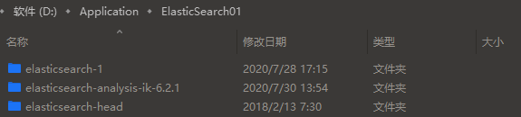
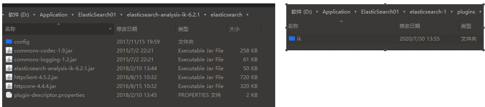
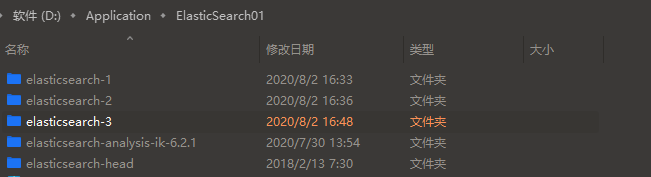
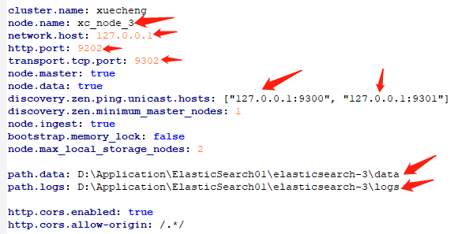
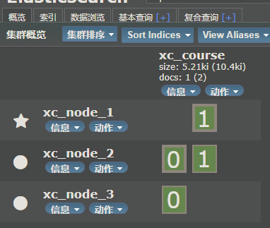

# 基本安装
先设置目录为01，为的是后面集群
- 1表示的是es的主目录，head表示的是浏览器集成插件，ik是分词器
需要将ik分词器中的文件复制到es主目录中，es主目录中的配置信息在本目录elasticsearch.yml

# 启动
- 启动es主目录中的bin目录下的elasticsearch.bat可启动es主程序
- 另外在head目录下打开命令行，执行npm run start启动浏览器集成

# 索引分词注意点
使用es进行搜索的时候，既能对索引库中的索引进行分词，也能对搜索条件分词再进行查询，
那么一般是如何设置分词条件呢？  IK分词器中ik_max_word(细颗粒),ik_mark(粗颗粒)

- 索引的时候分词，一般是粗颗粒还是细颗粒？
因为要尽可能查询出索引库中的数据，所以需要将索引库中的索引设置为细颗粒的，
-  那么搜索的时候设置的是粗颗粒还是细颗粒？
因为要尽可能的匹配用户输入条件的索引，那么就要对搜索条件的连贯性保持高度匹配，所以需要对搜索条件进行粗颗粒分词
如果是细颗粒的话，那么就有可能查询出无关文档，造成用户体验差

# 集群搭建
复制2个主目录，分别命名，然后设置每个的配置文件

如下图

- 注意：其中的127.0.0.1一定为该值（如果在一台物理机上的话，不能为0.0.0.0），否则就会不能发现集群，另外如果改完还是不能发现集群的话，可以删除各自主目录下的dat文件夹
如果还是不行，访问https://blog.csdn.net/huwei2003/article/details/47004745?ops_request_misc=%257B%2522request%255Fid%2522%253A%2522159635878519725250130823%2522%252C%2522scm%2522%253A%252220140713.130102334.pc%255Fblog.%2522%257D&request_id=159635878519725250130823&biz_id=0&utm_medium=distribute.pc_search_result.none-task-blog-2~blog~first_rank_v1~rank_blog_v1-1-47004745.pc_v1_rank_blog_v1&utm_term=Elasticsearch%E9%83%A8%E5%88%86%E8%8A%82%E7%82%B9%E4%B8%8D%E8%83%BD%E5%8F%91%E7%8E%B0%E9%9B%86%E7%BE%A4%28%E8%84%91%E8%A3%82%29%E9%97%AE%E9%A2%98%E5%A4%84&spm=1018.2118.3001.4187

# 集群中的分片和副本
如下图，我创建索引库时，分的是2片1副本，下图中的0和1表示的是2片，0和1各自有两个，那么第二个就是副本

